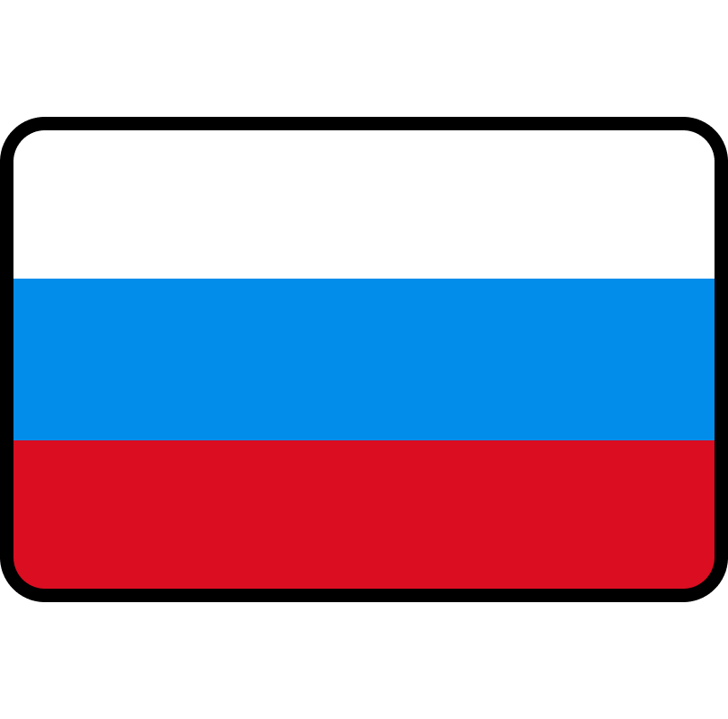

	 &nbsp;&nbsp;&nbsp;
	 &nbsp;&nbsp;&nbsp;
  
	
«если чесать голову возле уха, когда ваши волосы примерно равны 2см, делая движения верх-вниз, верх-вниз каждые 0.1 секунду, то получится fade-in синтезатор из интро трека We're In This Together, за авторством Nine Inch Nails»

  
✦balbescore✦

---

  
:bangbang: Utopist and people lover

  
:open_file_folder: Choosing a specific category, what to code. Github for FOSS collection;

  
:speaking_head: I'm speaking English(B1) and Russian(Native). Want to learn German and Esperanto (can’t get start);

  
:love_letter: Esperanto as a second language for Europe (worldwide)

  
:sparkles: Will live in trash in future!

